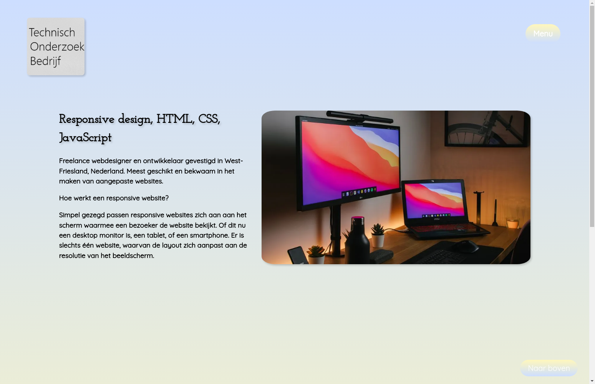

# Personal Portfolio Website

🌐 **Live URL**: [https://raimonvibe.github.io/Home/index.html](https://raimonvibe.github.io/Home/index.html)

## About

A responsive portfolio website showcasing web development and design work. Built with HTML, CSS, and JavaScript, this site demonstrates modern responsive design principles that adapt seamlessly to different screen sizes.

### Features

- Responsive design that works on desktop, tablet, and mobile devices
- Clean and modern user interface
- Showcases web development portfolio and skills
- Built with: HTML, CSS, JavaScript

### Developer

Freelance web designer and developer based in West-Friesland, Netherlands, specializing in creating custom websites with responsive design.

### Connect

- [3D Models on Cults3D](https://cults3d.com/en/users/raimonvibe/3d-models)
- [YouTube Channel](https://www.youtube.com/channel/UCDGDNuYb2b2Ets...)
- [Medium Blog](https://medium.com/@raimonvibe)
- [Personal Website](https://www.raimonvibe.nl/)

## Credits

- Developer photo by Nubelson Fernandes on Unsplash
- Responsive design photo by Domenico Loia on Unsplash

© 2024 www.raimonvibe.nl
